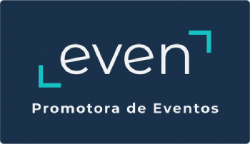
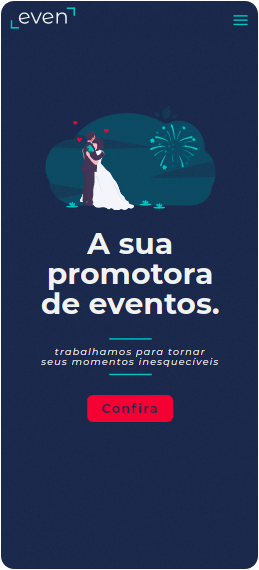

<h1 align="center">
    
     
  Site Institucional
</h1>

  

  
 
  

<h4 align="center">
  Esse é um modelo de site institucional para uma empresa de promoção de eventos.
</h4>

  <a href="#sobre">Sobre o projeto</a>&nbsp;&nbsp;&nbsp;|&nbsp;&nbsp;&nbsp;
  <a href="#license">Licença</a>

 
 
 

    
<h3>Large Size version 🖥️</h3>
    
    <h3>Mobile version 📱 </h3>
   

  
<h2 id="sobre">🔎 Sobre o Projeto</h2>
Projeto Front-end Web de um site institucional para empresas de promoção de eventos. Todo o layout foi pensado com base em critérios de UX (User Experience) e desenvolvido seguindo as melhores práticas de SEO para um projeto do tipo.

<h2 id="license"> :memo: Licença</h2>

Esse projeto está sob  a Licença MIT. Acesse [LICENSE](https://github.com/diegomagalhaes-dev/EVEN-Event-Promoter/blob/master/LICENSE) para mais informações.

Feito com ♥ por Diêgo Magalhães :wave: <a href="https://www.linkedin.com/in/magalhaesdiego/">Fale comigo!</a>.
